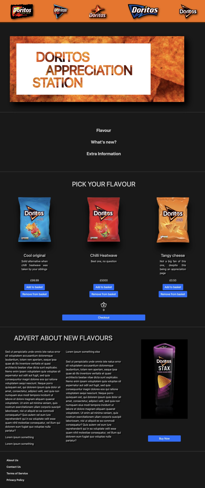

# BNTA - Shop landing page

## Welcome

This is your BNTA assessment day mini-project.

Challenges such as this one are created to help improve your coding ability and understanding by building realistic projects.

**To complete this challenge, you need a basic understanding of HTML and CSS.**

There is an extension task which requires the use of JavaScript.

## The Challenge

Your challenge is to **build out a shop landing page** which can be anything from a snacks or record shop to whatever excites you. You'll use the designs, code examples and what you've learned so far to guide you through the process—but don't be afraid to google things along the way that you don't understand. Software development varies so much between languages and product versions so being able to find the information you are looking for efficiently, is an important skill.

### Project Aims

**Your users should be able to:**

- Build your webpage correctly for viewing within a fullscreen desktop window using HTML & CSS

**Stretch goals:**

- Implement a Dark Mode button using HTML and JavaScript

The teaching from the first day of the assessment centre should put you in good stead for this project and what today aims to provide is a chance to put this learning into action.

### Teams

Each student will be placed into a group of 4—5 people. It is between yourselves how you organise your time. Each team will be announced at the beginning of the project day. We are looking as much for great teamwork as we are for individual contribution so please do support your teammates where you can!

**To collaborate** we advise using Live Share, an extension to VSCode. If you haven't installed Live Share already, don't worry. When you open VSCode you should see a panel on the left-hand side of your screen. Click the icon that looks like four little cubes (you can hover your mouse over the icon and it should say "Extensions"). In the search bar type 'live share' and install Live Share by Microsoft.

**Important note: Once you install Live Share, restart VSCode as the plugin will only work once you have done so**

Another Visual Studio Code extension you may find useful is 'Live Server'. This extension is used to allow the Live Share host to share their local server with all of the collaborators—allowing all workers to view the HTML webpage in the browser as if stored locally. For a short introduction to Live Server and how to set-up hot browser reloading (reloading upon saving of code), please watch this short 3 min video: [https://www.youtube.com/watch?v=y4qqQeUDCBQ](https://www.youtube.com/watch?v=y4qqQeUDCBQ)

### Support

Want some support on the challenge? Trainers are on-hand to support you but we advise you follow the process of **Brain, Book, Buddy, Boss** (in this case trainer) so that you first attempt to solve the problem yourself or as a team. Try to help each other and if you're still stuck, a trainer should be available to help.

## Starting Point

Your task is to build out the project using the designs inside the `/design` folder as inspiration. Both of the example sites have been built using the following Figma Design Examples board as a starting point, which you can similarly make use of:

[Figma Design Examples board](https://www.figma.com/file/Fs56TNlz7KIIxW9s7JoKKA/BNTA-Foundation-Days?node-id=0%3A1)

A `style-guide.md` file has also been included which also includes a link to a Figma design board alongside a link to a website where you can find stock images and colour palettes for your site. Further down there are also CSS attributes and small descriptions of what they can be used for to give you an idea of what to google throughout the day.

### Trello

We have designed a workflow to guide you through the creation of your website. This can be found in the form of ordered tasks and coding tasks in the Trello board that has been distributed to you below (don't forget to click on the cards for extra information!).

The workflow looks something like this:

1. Download the zip file from the Egnyte link provided. Extract the files.

2. Look through the design example to get an idea of how you'll tackle the project. This step is crucial to help you think ahead for CSS classes and their reusability e.g. seeing if there are any parts of your website that could be styled the same.

3. Begin working through the tasks on the Trello board, moving the tasks across the board as you complete them. You will first create the HTML for a feature of your website before adding the CSS, working from the top of the page down. Only move on to the next section once you're happy that you have completed the area you're working on.

Do not feel obligated to follow the tickets on the Trello board in order. They've been numbered according to how we've put together the example so feel free to follow your own aspirations when completing the tasks.

### Using the Trello Board

There's two things we would like to see being done when using the Trello board. These are **required** parts to the assessment days so please read carefully:

1. When working on a Trello ticket, please make sure that you click the task to open up the menu for that card and assign yourself as a worker (underneath the `ADD TO CARD` section there is a button labeled `Members`). This is a process used in Software Engineering so that team members can quickly see who is working on tasks relating to their project. This will also give us a means to see where each student has been working throughout the day.

2. When working on a task please move it to the `Doing` section of the board, and then, to `Reviewing/Testing` when you feel like you have your solution. Once your solution has been reviewed or tested and is working how you would like it to, please then move the card to the `Done` section. This allows members of your team to quickly visualise how your project is progressing and what tasks still need to be completed.

### Trello Board Links

Please click on the link that corresponds to your group number. If you haven't already got a Trello account, you will be prompted to make one. Please follow the process of signing up for an account and then proceed to joining your groups' Trello board.

**Group 1:** https://trello.com/invite/b/Rqs6MQE0/56db90740c808d4e0e0a85c9a65e4f62/bnta-c6b-group-1

**Group 2:** https://trello.com/invite/b/DvlqvJmy/0d8e2a482a076acc9f7e780a5479e33a/bnta-c6b-group-2

**Group 3:** https://trello.com/invite/b/01rGUIUF/4a5b7600fbbdb4dba479b8f29334daa8/bnta-c6b-group-3

**Group 4:** https://trello.com/invite/b/e8Ts1vtt/33cc124c16043696c7102bbef12c9ae8/bnta-c6b-group-4

**Group 5:** https://trello.com/invite/b/qsYgePDy/7df343d1c8bcf6c4ff850d9dc04f2c77/bnta-c6b-group-5

## Useful Resources

- [W3schools](https://www.w3schools.com/) - W3Schools is best used as a reference for HTML, CSS and JavaScript when searching for syntax and basic explanations of functionality.
- [MDN Web Docs](https://developer.mozilla.org/en-US/) - The MDN Web Docs site provides information about HTML, CSS and JavaScript. You may find that the MDN explanations go into great depth, explaining functionality at a more base-level. They are great for checking what properties relate to one-another and what arguments can be provided.

## Finishing Details

### Create a Custom `README.md`

We strongly recommend adding a `README.md` to your project. We have provided a template inside the [`README-template.md`](./README-template.md) file in this starter code.

The template provides a guide for what to add. A custom `README` will help you explain your project and reflect on your learnings. It may be a great starting point for organising your presentations. Please feel free to edit our template as much as you like.

To edit a markdown (`.md`) file, you can simply use any text editor. Markdown is a file type that uses specific symbols to add in visual-contextual information to your document (for instance, a pair of asterisks `**` can be used to bold a word if placed either side of said word, *e.g.* \*\*bold\*\* turns to **bold**).

A `README.md` file will make it show up as your repository's README file on Github by default if you later host your work there.

### Preparing For Your Presentation

- Presentation Start Time: 3:30pm (arrive just before)
- Presentation Duration: 10 minutes each group (7 minute presentation, 3 minutes for questions)

What we would love to see is for each team member to pick a part of the project that they've worked on, that they are feel pleased with, and to spend roughly a minute speaking through how their code works.

60 seconds each is not a long time so organise what you are going to say in advance! Ideally, you will have completed a couple test-runs of your presentation before the full afternoon session.

Because there are so many people talking within such a short amount of time, we **strongly recommend** that only a single person shares their screen for the presentation.

## Deploying Your Project

There are many ways to host your project for free. If you would like to host your website after the assessment day then you can check out using our recommended host, GitHub Pages. We do stress however that this is **not a requirement of the assessment day** and that deployment should be left until after the assessment.

- [GitHub Pages](https://pages.github.com/)

## Got Feedback For Us?

We love receiving feedback! We're always looking to improve our challenges and our processes. So if you have anything you'd like to mention, please add it to the assessment day survey that we will be sending out in a couple of weeks.

**Have fun building!** 🚀

##Example Designs

